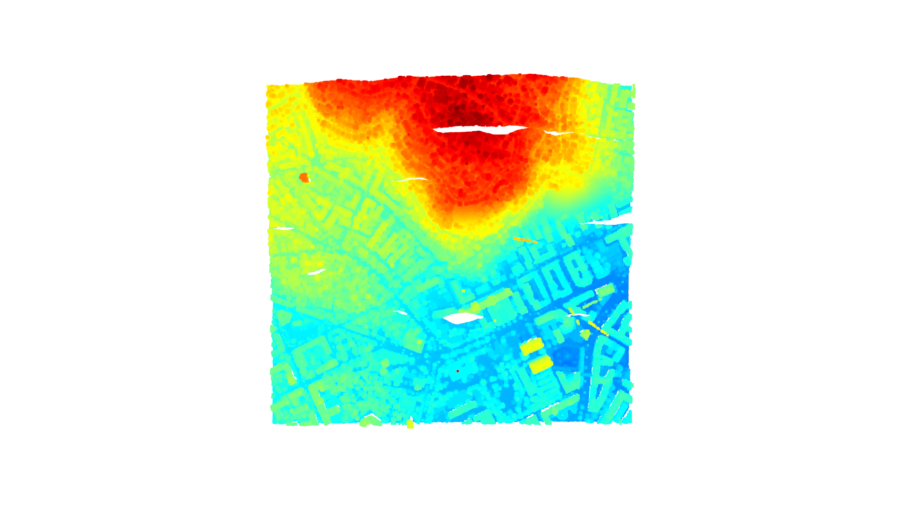
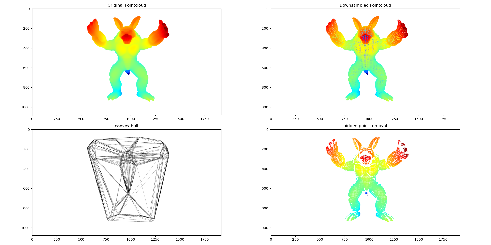
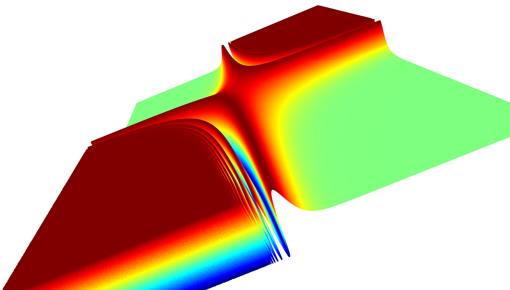

## Computer_vision

my playground for learning about point cloud processing and computer vision. 
Most of it is done in notebooks, such that the results can be nicely visualized on github.
The main libraries used here are cv2, open3d and matplotlib.

*Example pointcloud*

*Hidden point removal*

*3d numpy plot*

https://github.com/edvart-ros/computer_vision/assets/94528774/72d3cd6a-0d8d-4e46-a8bc-d6d05435eb01

